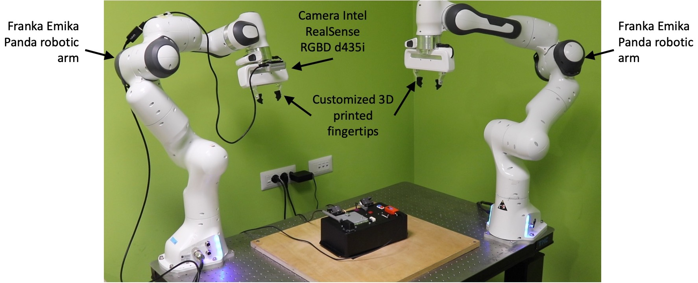
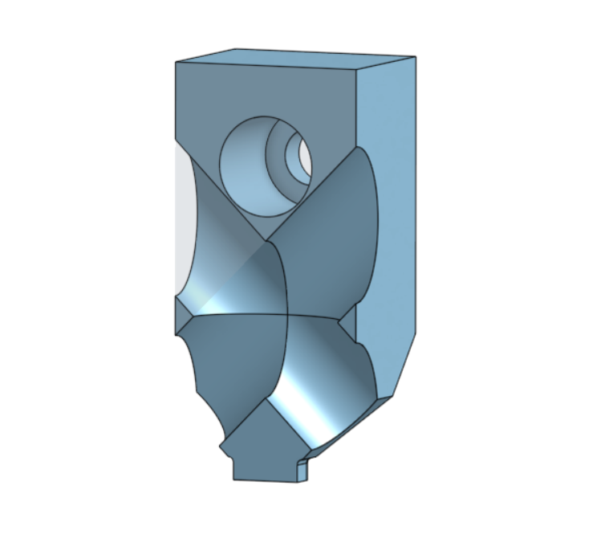
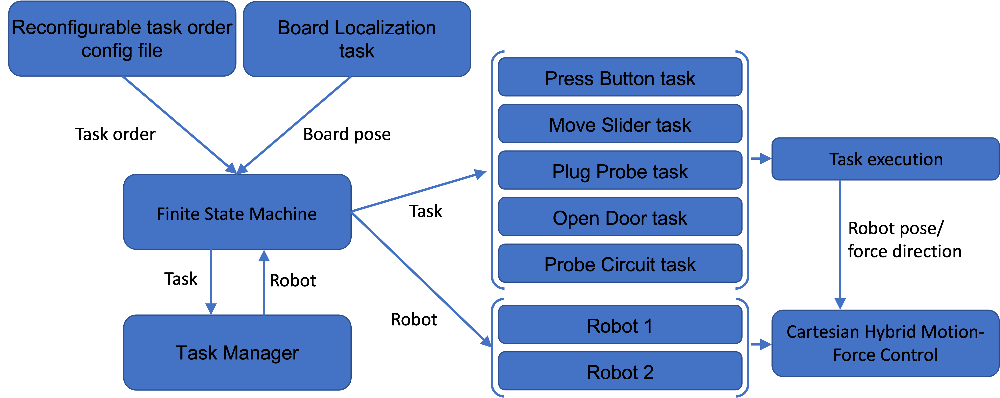
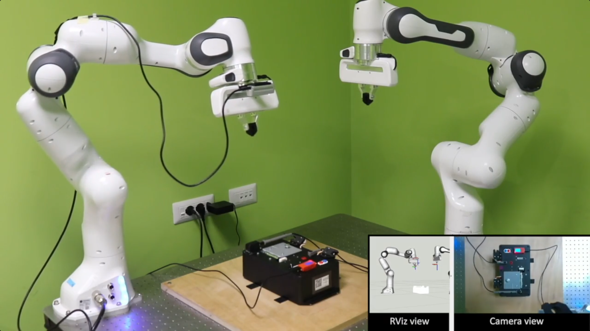
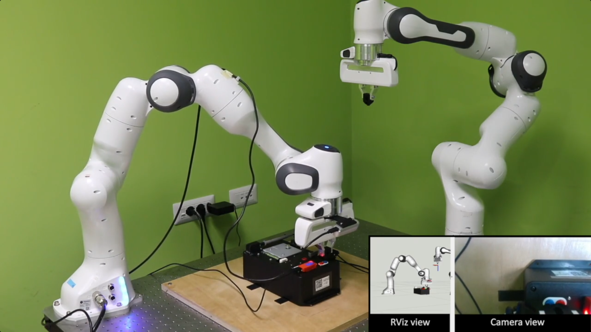
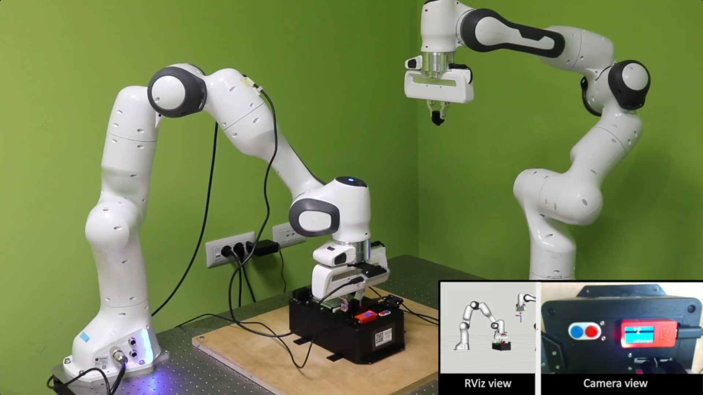
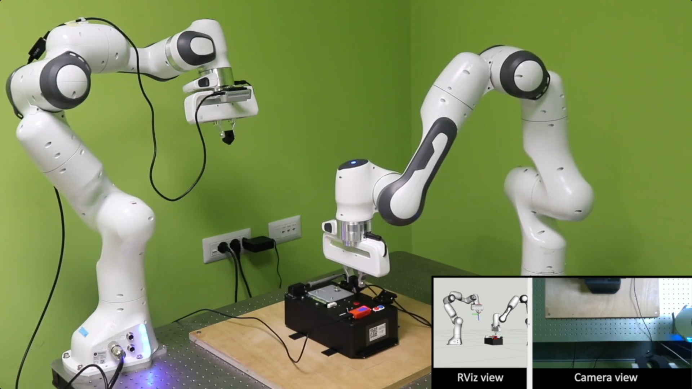
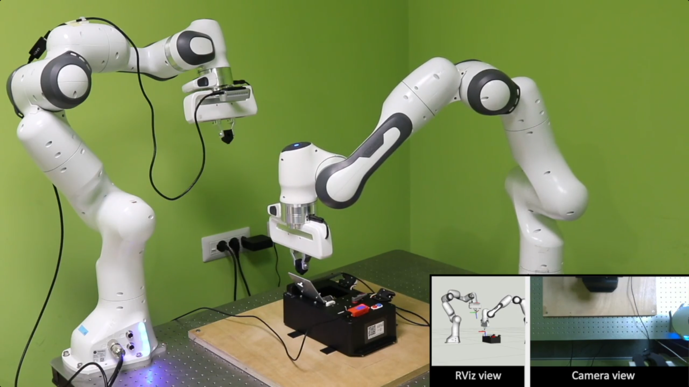
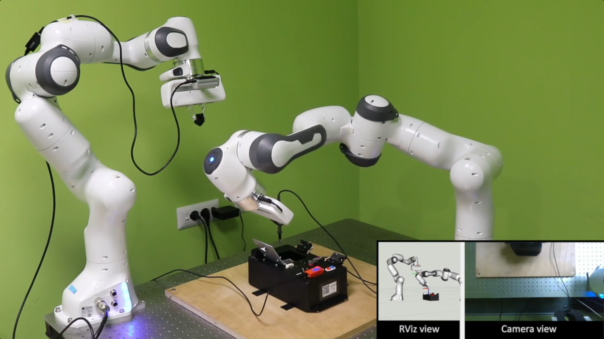
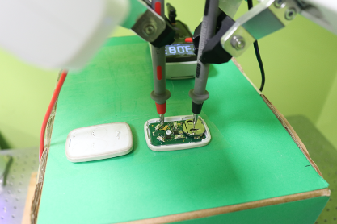

# Robothon Grand Challenge 2023 - Team Upcyclers report
This repo contains the project documentation of the tasks developed by "Team Upcyclers" from [HRII lab](https://hri.iit.it/)@[IIT](https://www.iit.it/it/home)  during the [Robothon Grand Challenge 2023](https://automatica-munich.com/en/munich-i/robothon/).

## Hardware setup
The hardware setup is composed by two [Franka Emika](https://www.franka.de/) robots installed on a working table. An [Intel Realsense D435i](https://www.intelrealsense.com/depth-camera-d435i/) as been mounted on a Franka Emika end-effector. 
<p align="center">
  
</p>

Customized 3D printed fingertips have been designed: small tip for fine precision task (Press button and Move slider) and cross design to enable precise grasping of the probe from both directions. 
<p align="center">
  
</p>

## Software architecture
The software architecture implemented for the competition relies on a finite state machine, where each task is a state. Through a reconfigurable config file, it is possible to define the execution order of the tasks.

<p align="center">
  
</p>

A cartesian hybrid motion-force controller as been implemented in order to switch from motion control to force control.

## Task: Board localization
In the initial stage, the camera uses color detection and the least squares method to accurately detect the blue and red buttons on the board and gain an initial perception of the board's location in the world frame using the urdf of the board. Later, the arm moves towards the board and uses visual servoing to detect specific features, position them at the center of the camera's field of view and improve the accuracy of the board's position and orientation estimation.
<p align="center">
  
</p>


## Task: Press blue/red button
In press blue and button tasks, the robot approaches the desired button and apply a 10N force to it.
<p align="center">
  
</p>


## Task: Move slider
The manipulator with the camera installed at the end-effector detect the reference triangle on the M5 display. The robot move the slider applying the computed displacement. This is repeated for the second reference.
<p align="center">
  
</p>

## Task: Plug probe
The probe connector is grasped and moved to the desired red hole. The insertion is performed exploiting the force controller, by apply a 20N force on the vertical axis.
<p align="center">
  
</p>

## Task: Open door
The door open task has been performed grasping the door handle. A semi-circular motion of 90° allowed the door opening.
<p align="center">
  
</p>

## Task: Probe circuit
A fine grasping of the probe is perfoming thanks to the custom 3D printed fingertips. The circuit is therefore probed.
<p align="center">
  
</p>

## Bring-your-own-device challenge
For the transferability demo, we decided to make the robot open and probe an everyday tool, i.e. a gate opener remote. The robot needs to perform the following subtasks:

- Turn on multimeter dial;
- Open remote case;
- Grasp the probes;
- Probe the circuit;
- Detect voltage and show it on GUI.

<p align="center">
  
</p>


## Repositories
- [robothon-2023-board-localization](https://github.com/hrii-iit/robothon-2023-board-localization): Vision module implemented for the task board localization.
- [robothon-2023-byod](https://github.com/hrii-iit/robothon-2023-byod): "Bring Your Own Device" ROS-package.
- [robothon-2023-msgs](https://github.com/hrii-iit/robothon-2023-msgs): This repo contains the messages and services needed to run the challenge.
- [robothon-2023-board-description](https://github.com/hrii-iit/robothon-2023-board-description): This repository contains the description of the Robothon 2023 competition task board.
- [robothon-2023-fsm](https://github.com/hrii-iit/robothon-2023-fsm): Finite state machine to run the framework developed for the Robothon Grand Challenge 2023.

## Quick start
Here you can find the instructions to run the framework developed by our team for the Robothon Grand Challenge 2023.

### Prerequisites
Clone libfranka (0.9.2) library and build it:
```bash
git clone --recursive https://github.com/frankaemika/libfranka --branch 0.9.2

```
Enter libfranka folfer and execute these commands:
```bash
mkdir build
cd build
cmake -DCMAKE_BUILD_TYPE=Release -DBUILD_TESTS=OFF ..
cmake --build .
```

### Installation instructions
Clone in your catkin ws the *robothon-2023-fsm* package and its dependencies listed in the previous section. Build your ws.
_Note:_ to make sure it compiles you also need some licensed packages, ask the repo owner.

### Usage
Test that everything works fine, launching the following command:
```bash
roslaunch hrii_task_board_fsm main_fsm.launch

# if your camera is disconnected and want to run a fake perception node to test the tasks wun
roslaunch hrii_task_board_fsm fake_perception.launch
```

### Tips
In the file config/fsm/default_task_order.yaml you can select the task execution order.
You can also define a customized file that will be ignored by git, just create it in the same folder under the name _custom_task_order.yaml_

## Team members

<table>
  <tbody>
    <tr>
      <td align="center"><a href="https://github.com/pietrobalatti"><br /><sub><b>Pietro Balatti<br /></b></sub></a><br /></td>
      <td align="center"><a href="https://github.com/mleonori"><br /><sub><b>MattiaLeonori<br /></b></sub></a><br /></td>
     <td align="center"><a href="https://github.com/Hamidraei23"><br /><sub><b>Hamidreza Raei<br /></b></sub></a><br /></td>
      <td align="center"><a href="https://github.com/poliandre98"><br /><sub><b>Andrea Fortuna<br /></b></sub></a><br /></td>
    </tr>
  </tbody>
</table>
